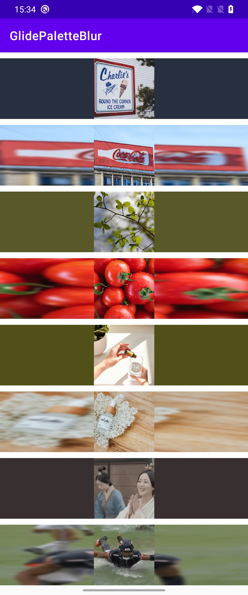
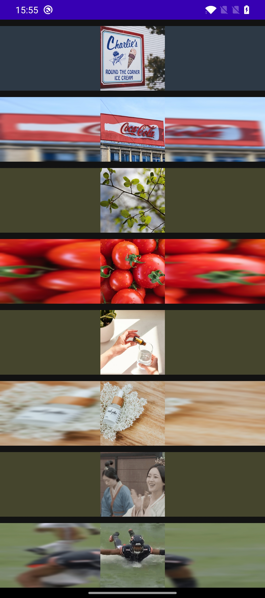

[](https://jitpack.io/#shenguojun/GlidePaletteBlur)

# GlidePaletteBlur

Combined with Glide to generate palette color or blur bitmap.

- [x] Gif supported
- [x] Dark theme supported

<p align="center">
  
  
</p>

## How to use
1. For Palette:

   ```kotlin
   Glide.with(view)
       .load(image)
       .listener(GlidePalette().generate { palette ->
           getBgFromPalette(palette).let { color ->
               view.ofTypeParent<ConstraintLayout>()?.setBackgroundColor(color)
           }
       })
       .into(view)
   ```

2. For blur:

   ```kotlin
   Glide.with(view)
       .load(image)
       .listener(GlideBlur().generate { bitmap ->
           view.ofTypeParent<ConstraintLayout>()?.background =
               BitmapDrawable(resources, bitmap)
       })  
       .into(view)
   ```

   

3. Add to project:

   ```groovy
   allprojects {
     repositories {
       // ...
         maven { url 'https://jitpack.io' }
     }
   }
   ```

4. Add dependency:

   ```groovy
   dependencies {
     implementation 'com.github.shenguojun:GlidePaletteBlur:1.1.0'
   }
   ```

Have fun!
