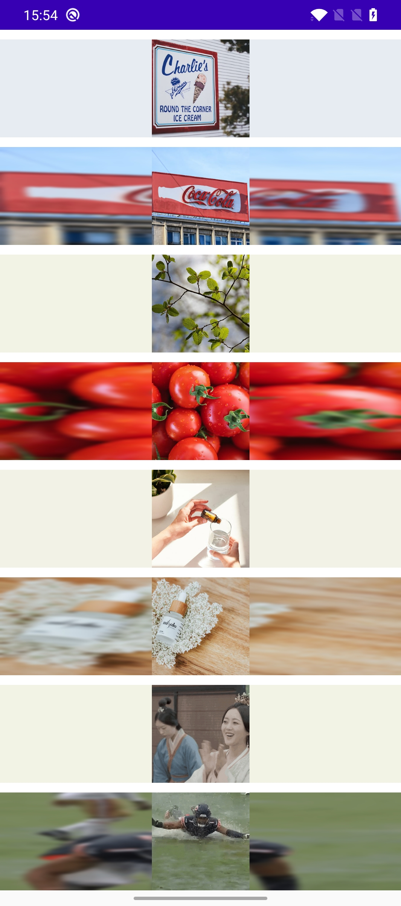

# GlidePaletteBlur
Combined with Glide to generate palette color or blur bitmap.



## How to use
1. For Palette:

   ```kotlin
   Glide.with(view)
       .load(image)
       .listener(GlidePalette().generate { palette ->
           palette?.darkColor()?.let { paletteColor ->
               view.ofTypeParent<ConstraintLayout>()?.setBackgroundColor(paletteColor)
           }
       })
       .into(view)
   ```

2. For blur:

   ```kotlin
   Glide.with(view)
       .load(image)
       .listener(GlideBlur().generate { bitmap ->
           view.ofTypeParent<ConstraintLayout>()?.background =
               BitmapDrawable(resources, bitmap)
       })  
       .into(view)
   ```

   